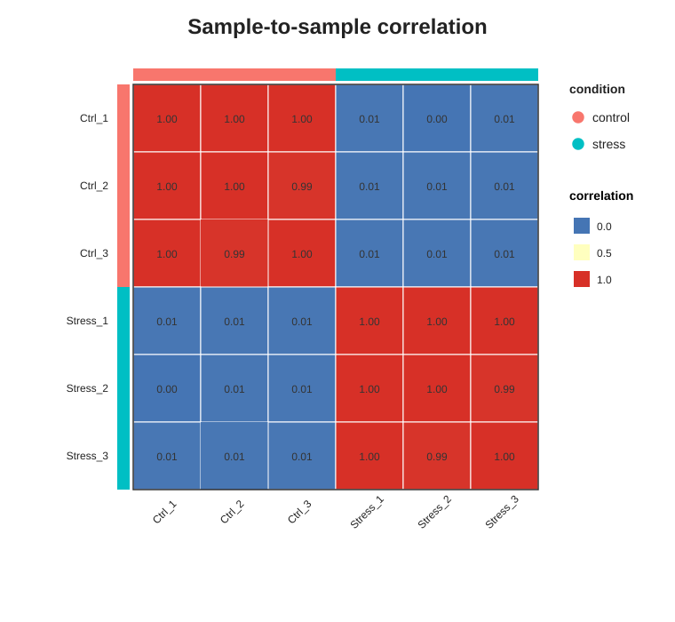
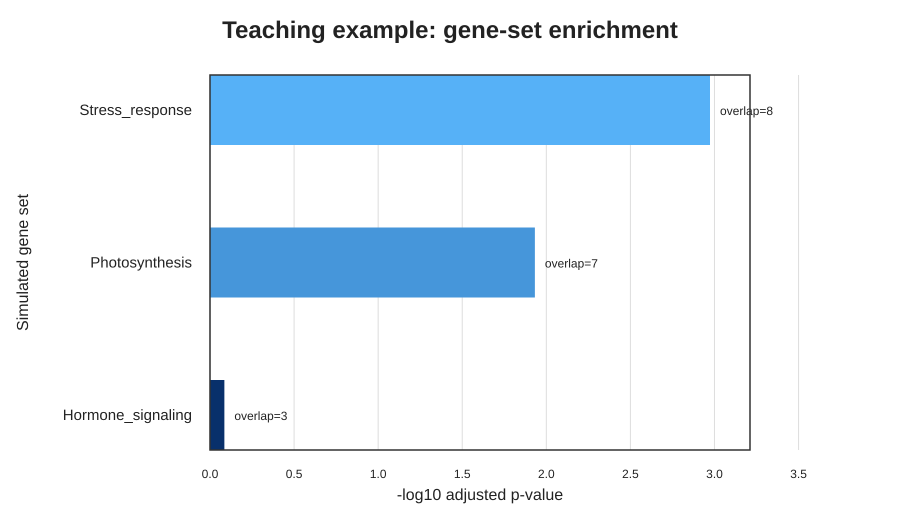

# 02 RNA-seq Differential Expression Demo

## 项目目的

这个项目演示 RNA-seq read-count 矩阵的标准下游分析流程：

1. 检查计数矩阵和样本信息。
2. 使用 DESeq2 进行标准化和差异表达分析。
3. 使用 PCA 检查样本整体关系。
4. 输出差异表达基因表、火山图和热图。
5. 补充样本相关性检查和 Markdown 结果解读报告。
6. 使用教学用基因集初步理解后续功能解释。

项目重点是理解分析逻辑和文件之间的关系，不是从模拟数据中提出真实生物学结论。

## 数据说明

本项目使用自行构造的小型模拟数据：

- 36 个模拟基因
- 6 个样本
- control 组 3 个生物学重复
- stress 组 3 个生物学重复
- 输入值为非负整数，模拟 RNA-seq read counts

文件：

```text
data/
├── counts.csv       # 行是基因，列是样本
├── metadata.csv     # 样本及实验分组
└── gene_sets.csv    # 教学用“基因—功能集合”对应关系
```

这些数据不是实际测序结果。使用模拟数据的原因是文件很小、运行快，适合学习和检查代码。

## 使用工具

- R：统计分析语言
- DESeq2：RNA-seq count 数据差异表达分析
- ggplot2：PCA、火山图和富集结果作图
- pheatmap：表达热图

## 为什么使用 DESeq2

RNA-seq counts 不是连续正态数据。DESeq2 使用负二项分布建模，并估计样本大小因子和基因离散度，比直接对原始 counts 做普通 t 检验更符合 RNA-seq 数据特点。

说明：本项目的数据是小型模拟数据，重复之间的差异被设计得比较整齐。运行时如果 DESeq2 的标准离散度曲线拟合失败，脚本会自动改用 gene-wise dispersion 估计继续完成教学分析；这适合本示例的可复现演示，但真实项目应优先使用完整数据和标准 DESeq2 流程。

## 分析流程

### 第一步：进入项目目录

```bash
cd 02_rnaseq_deg_demo
```

后续命令默认在这个目录执行。

### 第二步：检查输入文件

```bash
head data/counts.csv
cat data/metadata.csv
```

检查要点：

- `counts.csv` 的样本名应与 `metadata.csv` 的 `sample` 列一致。
- counts 应为非负整数。
- 每个实验组至少有生物学重复。

### 第三步：运行 DESeq2

```bash
Rscript scripts/01_deseq2_analysis.R
```

解释：

- `Rscript`：以非交互方式运行 R 脚本。
- 脚本读取 `data/`，并把表格写入 `results/`、图片写入 `figures/`。

脚本完成：

1. 读取 count 矩阵和样本信息。
2. 检查样本名、重复基因和非法 count。
3. 过滤总 count 小于 10 的低表达基因。
4. 设置 `control` 为参考组。
5. 拟合 `~ condition` 的 DESeq2 模型。
6. 计算 `stress` 相对 `control` 的变化。
7. 使用 `padj < 0.05` 且 `|log2FoldChange| >= 1` 定义教学用 DEG。

### 第四步：运行富集分析演示

```bash
Rscript scripts/02_enrichment_demo.R
```

这个脚本使用超几何检验，判断 DEG 是否在某个教学用功能集合中过度出现。

注意：`gene_sets.csv` 是模拟注释。正式项目应换成目标物种的 GO、KEGG 或其他可靠注释。

### 第五步：生成样本检查图和结果摘要

```bash
Rscript scripts/03_qc_and_summary.R
```

这个脚本会读取前两步生成的差异表达和富集结果，进一步输出：

- 文库大小图：检查每个样本的总 count 是否可比。
- 样本相关性热图：检查同组重复是否更相似。
- Top DEG 表：方便快速查看最显著的候选基因。
- Markdown 结果摘要：把核心发现、局限性和下一步写成可阅读报告。

## 关键结果如何理解

### log2FoldChange

- `log2FoldChange = 1`：stress 组约为 control 组的 2 倍。
- `log2FoldChange = -1`：stress 组约为 control 组的 1/2。
- 正值表示在 stress 组上调，负值表示下调。

### pvalue 与 padj

同时检验很多基因会增加假阳性，因此使用多重检验校正后的 `padj`。项目用 `padj < 0.05` 作为阈值。

### PCA

PCA 将所有基因的表达信息压缩到少数坐标轴：

- 同组重复接近，说明整体表达模式相似。
- 两组分开，说明处理条件可能造成系统性表达变化。
- PCA 不能单独证明某个具体基因具有功能。

### 火山图

- 横轴：`log2FoldChange`
- 纵轴：`-log10(padj)`
- 右上方通常为显著上调基因
- 左上方通常为显著下调基因

## 预期结果

运行后会生成：

```text
results/
├── all_deseq2_results.csv
├── analysis_summary.md
├── deg_results.csv
├── enrichment_results.csv
├── normalized_counts.csv
└── sample_correlation_matrix.csv

figures/
├── enrichment_barplot.png
├── library_size_barplot.png
├── pca.png
├── sample_correlation_heatmap.png
├── top_genes_heatmap.png
└── volcano_plot.png
```

说明：GitHub 页面中展示的是对应的 SVG 预览图，核心分析逻辑仍然是上面的 R 脚本和结果表。

预期现象：

- control 的三个重复在 PCA 中较接近。
- stress 的三个重复在 PCA 中较接近。
- 一部分基因明显上调，一部分基因明显下调。
- 热图能够区分两组样本。
- 模拟的 `Stress_response` 等功能集合可能出现富集。

这些现象来自预先设计的小型数据，只能说明代码流程正常。

## 当前结果速览

本仓库已运行完整流程，当前输出显示：

- 共测试 36 个模拟基因。
- 使用 `padj < 0.05` 且 `|log2FoldChange| >= 1` 得到 15 个教学用 DEG。
- stress 组上调基因 8 个，下调基因 7 个。
- 教学用富集结果中，`Stress_response` 和 `Photosynthesis` 排名最靠前；这只是模拟注释下的练习结果。
- PCA 和样本相关性热图均显示 control 与 stress 两组可以被明显区分。

代表性图片：






## 我学到了什么

- RNA-seq 分析需要 count 矩阵和正确的样本分组信息。
- 生物学重复是估计组内变异的基础。
- 差异表达不仅看倍数变化，也要看统计显著性和多重检验校正。
- PCA 用于观察样本整体结构，样本相关性用于检查重复是否合理。
- 富集分析可以帮助从 DEG 走向功能解释，但结论受背景基因集和注释质量影响。
- 可复现项目应同时保存代码、输入说明、软件版本、表格和图片。

## 局限性与下一步

当前项目没有包含：

- FASTQ 原始数据质控
- reads 比对或转录本定量
- 批次效应
- 真实基因 ID 和物种注释
- 独立实验验证

下一步可选择一个公开植物 RNA-seq 数据集，把 `counts.csv` 和 `metadata.csv` 替换为真实数据，并在 README 中记录 GEO/SRA accession、实验设计和论文来源。
