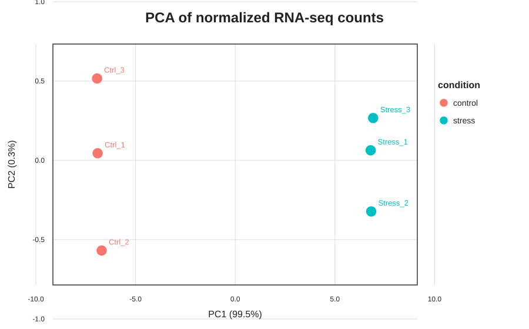
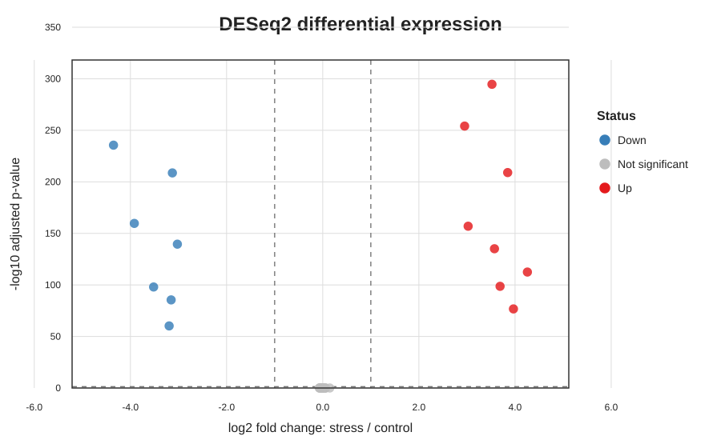

# Bioinformatics Portfolio

这是一个面向生物科学本科生的入门级生物信息学作品集，用于展示我对 Linux、R、RNA-seq 差异表达分析和文献整理的基础理解。

本仓库强调三点：

1. **可复现**：分析步骤由脚本完成，不依赖手工修改结果。
2. **可解释**：每个项目都说明输入、命令、输出和结果含义。
3. **诚实呈现**：教学数据与真实公开数据会明确区分，不把模拟结果包装成科研发现。

## 最新展示结果

RNA-seq demo 已补充差异表达分析、样本检查、基础可视化和结果解读。当前使用小型模拟数据，重点展示我正在学习标准 RNA-seq 分析流程，并能把每一步整理成可复现文件。

| 输出 | 能说明什么 |
|---|---|
| PCA | 检查样本是否按实验条件分开 |
| 火山图 | 同时展示差异倍数和统计显著性 |
| 样本相关性热图 | 检查生物学重复之间是否更相似 |
| 富集柱状图 | 初步理解 DEG 后续功能解释的思路 |





## 项目概览

| 项目 | 展示能力 | 主要产出 |
|---|---|---|
| [01_linux_practice](01_linux_practice/) | Linux 文件操作、文本处理、Shell 脚本 | 筛选表、排序表、统计摘要 |
| [02_rnaseq_deg_demo](02_rnaseq_deg_demo/) | R、DESeq2、差异表达、PCA、火山图、样本相关性检查 | DEG 表、分析图、结果解读报告 |
| [03_nac20_literature_mining](03_nac20_literature_mining/) | PubMed 检索、文献元数据整理、关键词统计 | 文献表、年份统计、关键词图 |
| [04_go_enrichment_visualization](04_go_enrichment_visualization/) | R 数据清洗、GO 富集结果筛选、发表级可视化 | GO 气泡图、入图数据表 |

## 这个作品集想展示的能力

- 能把输入数据、脚本、结果表和图片组织成清晰的可复现项目。
- 能在差异表达前检查样本信息，并在结果出来后用 PCA 和样本相关性检查结果是否合理。
- 能解释 log2 fold change、adjusted p-value、PCA 和火山图各自回答的问题。
- 能识别模拟数据和真实生物学结论之间的边界，不夸大结果。
- 能把分析结果写成老师容易检查的 Markdown 报告和图表。

## 仓库结构

```text
bioinformatics-portfolio/
├── README.md
├── LICENSE
├── .gitignore
├── docs/
│   └── github_upload_guide.md
├── setup/
│   ├── check_environment.R
│   └── install_r_packages.R
├── 01_linux_practice/
├── 02_rnaseq_deg_demo/
├── 03_nac20_literature_mining/
└── 04_go_enrichment_visualization/
```

每个项目内部尽量采用相同结构：

```text
项目目录/
├── README.md       # 项目说明和运行方法
├── data/           # 小型输入数据
├── scripts/        # 可复现分析脚本
├── results/        # 脚本生成的表格
└── figures/        # 脚本生成的图片
```

## 运行环境

建议使用 Linux、macOS，或 Windows 的 WSL。需要：

- Bash
- R 4.2 或更高版本
- Python 3（仅文献下载脚本需要）
- R 包：`DESeq2`、`ggplot2`、`pheatmap`

先进入仓库：

```bash
cd bioinformatics-portfolio
```

检查 R 环境：

```bash
Rscript setup/check_environment.R
```

如果提示缺少 R 包，运行：

```bash
Rscript setup/install_r_packages.R
```

这条命令会联网安装缺失的软件包。安装完成后，再运行一次环境检查。

## 推荐学习顺序

```bash
# 1. Linux 文本处理
cd 01_linux_practice
bash scripts/01_text_processing.sh

# 2. RNA-seq 差异表达
cd ../02_rnaseq_deg_demo
Rscript scripts/01_deseq2_analysis.R
Rscript scripts/02_enrichment_demo.R
Rscript scripts/03_qc_and_summary.R

# 3. NAC20 文献统计
cd ../03_nac20_literature_mining
Rscript scripts/02_text_mining.R data/pubmed_records.csv
```

每条命令都应在对应项目目录中执行。详细解释见各项目的 README。

## 当前边界

- RNA-seq 项目使用小型模拟 read-count 数据，只用于学习分析流程。
- 文献项目只处理标题、摘要等公开元数据，不下载论文全文。
- 模拟数据得出的差异基因和富集结果不代表真实生物学结论。
- 后续可将 RNA-seq 项目替换为 GEO/SRA 中具有生物学重复的公开植物数据集。

## 联系导师时介绍

用下面的结构简要介绍，不要夸大项目深度：

> 我独立整理了一个入门级生物信息学作品集，包括 Linux 文本处理、基于 DESeq2 的小型 RNA-seq 差异分析，以及 NAC20 相关 PubMed 文献元数据整理。项目目前以理解和复现标准流程为主，代码、输入数据和结果均可追踪。我希望下一步在真实转录组数据上继续完善质控、定量、富集分析和生物学解释能力。

## 后续改进

- 增加真实公开 RNA-seq 数据集及其 accession
- 增加 FastQC、MultiQC、比对或 Salmon 定量
- 使用真实物种注释完成 GO/KEGG 富集
- 为关键结果补充文献证据和局限性说明
- 添加 Conda 环境文件和自动化测试
